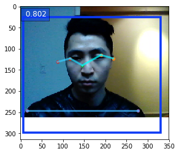
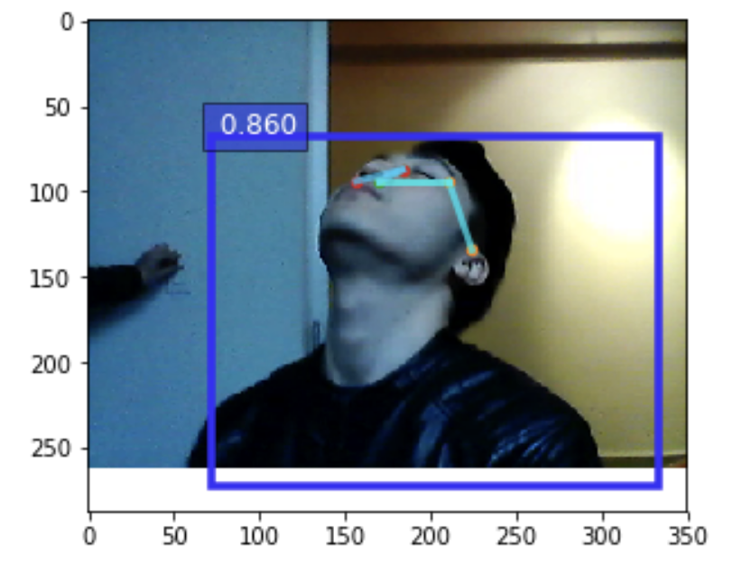
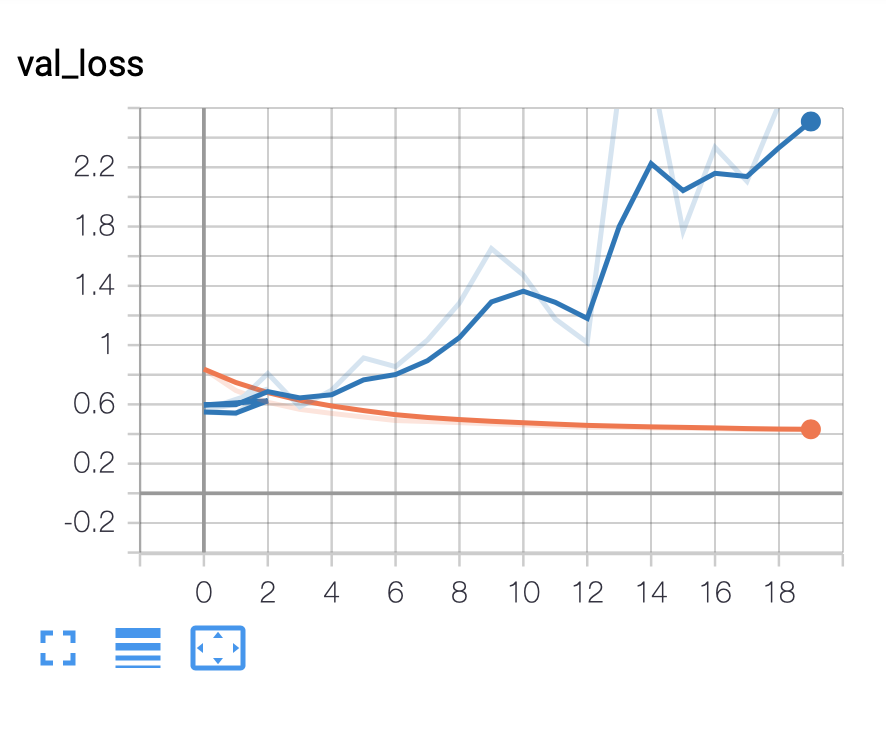
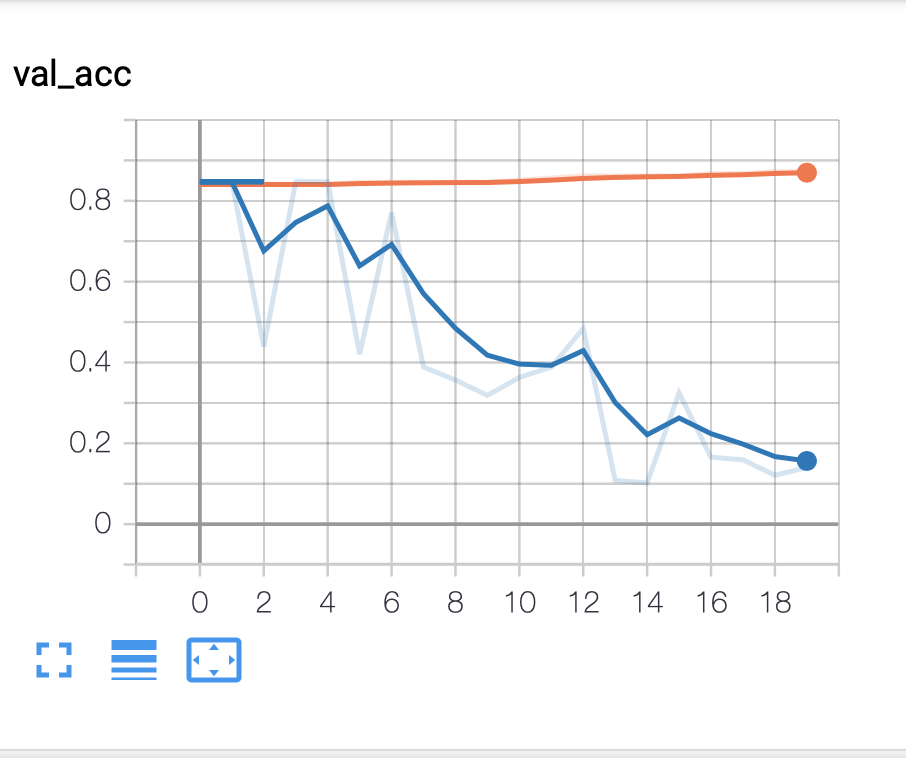

# Neckare

- [Neckare](#neckare)
  * [Tagline](#tagline)
  * [Summary Paragraph](#summary-paragraph)
  * [Additional resources](#additional-resources)
  * [Team Members](#team-members)
  * [Installations & Reproduction Detailed Instructions](#installations---reproduction-detailed-instructions)
- [Model Explanation](#model-explanation)
  * [Installation](#installation)
  * [Reproducibility](#reproducibility)
  * [Model explanation](#model-explanation)
  * [Our approach](#our-approach)
    + [Results](#results)
    + [PoseNet explanation](#posenet-explanation)
  * [One Page Article](#one-page-article)

<small><i><a href='http://ecotrust-canada.github.io/markdown-toc/'>Table of contents generated with markdown-toc</a></i></small>

## Tagline

A creative sustainable way to incentivize people to do neck exercises to prevent or cure neck strain 

## Summary Paragraph

With Neck Wonder, we are attempting to tackle a [US $88bn a year problem](https://www.theguardian.com/society/2017/feb/10/epidemic-of-untreatable-back-and-neck-pain-costs-billions-study-finds) affecting one million people annually.By combining Machine Learning Models and and an attractive rewards scheme, we aim to help the white collared workers most affected by neck pain due to poor posture over long periods of time build a habit of stretching regularly and thus improving their postures. 

## Additional resources

Case Studies:
- [Neck pain management case study](https://www.physio-pedia.com/The_Management_of_Neck_pain:_A_Case_Study)
- [Analysis of the problem](https://www.theguardian.com/society/2017/feb/10/epidemic-of-untreatable-back-and-neck-pain-costs-billions-study-finds)
- [Effectiveness of an application-based neck exercise as a pain management tool for office workers with chronic neck pain and functional disability: A pilot randomized trial](https://www-sciencedirect-com.libproxy1.nus.edu.sg/science/article/pii/S1876382017300987#!)

Video:
- [Video Demonstration of the simple stretch exercise]()

## Team Members
- Simon, Machine Learning engineer
- hexicle, Software Developer
- Gshfrez, Project Leader

## Installations & Reproduction Detailed Instructions

This is the link of our machine learning code (model training and prediction):
https://github.com/Gshfrez/neckare/tree/master/code

- To Install : https://github.com/Gshfrez/neckare/tree/master/code
- To Reproduce Results : https://github.com/Gshfrez/neckare/tree/master/code

# Model Explanation

## Installation
Run the command `pip3 install -r requirements.txt` to install all the python package dependencies.

## Reproducibility
Execute the notebook `PoseNet.ipynb` and follow the instructions.

(Optional)
3. In the root directory, place a video file of filetype and with the file extension `mp4` for extracting your own data, and launch the extraction in `PoseNet.ipynb`.

## Model explanation
The model predicts different human postures based on camera images.

## Our approach

We took different videos of us, and extract the corresponding sequence of pictures, and we do the labelisation by hand using a python script.

Our first approach was to use the full images to classify the different postures. But the model takes time to train, and a lot of overfitting was present, even with pre trained model, data augmentation and regularizations techniques. The only solution was to add more images, but we did not have the time for that.

We decided to take a completely new approach. Instead of training the model based on RGB images, we decided to train the model based on the output of an existing human pose estimation model: Google's PoseNet. [Blog post][https://medium.com/tensorflow/real-time-human-pose-estimation-in-the-browser-with-tensorflow-js-7dd0bc881cd5]

The idea is that, using 17 2D points instead of a full image, it will be much more difficult for the network to overfit.

This approach can be seen as transfer learning for new classes of human pose estimations.
To our knowledge, we did not see similar techniques in the literature.

This is the part of our machine learning pipeline that is trainable. Only a linear model on 34 parameters:

### Results

We compared both results by looking at the validation loss.
As the graphics below demonstrate, the convergence of the new model is much faster, and the `val_loss` is slower.

The blue line corresponds to our model based on pose estimations, whereas the other model is based on a pre-trained MobileNet.

### PoseNet explanation
PoseNet is an existing network, who tries to predict the 17 basics keypoints of human pose :

And here is the neural network architecture to predict the 17 keypoints (a mobile net with a heatmap for each keypoint as output):

## One Page Article

Our project taps into the prevalent problem of neck strain among office workers. Through creative means of incentivizing people to do the exercises, in the form credits, The credits can then be used to donate to NGO, get discounts from popular vendors like amazon or healthcare professionals. Sources of the credits vary, for instance, insurance companies who want their clients to be healthy and safe. Since the old-fashioned way of providing informative knowledge does not turn into proactive illness prevention actions, we propose this sustainable model to solve this issue via gamification with other accompanying social benefits.

Professionally speaking, this exercise “chin tuck in and rotate head” proves to be one of the simplest neck exercises in preventing and curing office-work-related neck-shoulder-strain. In this sense, it serves not just as a preventive but also curing method as far as neck strain goes.

Also by having the user record his pain scores (VAS) over time, the individual may see the results vividly. The VAS data that is generated can then be used as a reference for healthcare professionals/physio therapists to discern which exercise might be more effective over others. Too often, the lack of experimental data and the difficulty to conduct control experiments prove to be challenging for physio therapy researchers.

This also serves a way to incentivize users to do the exercise in an indirect way. We have this functionality for users to share their pain score graph with others. With the stories of people who successfully recover from neck strain by simply doing the exercise, the less persistent users will be encouraged to keep doing the exercise. When the exercises prove to be less effective for some users, for example if the pain score does not show any good signs over a given period of time, we also try to prompt immediate action of going to the physiotherapist. With the existing sustainable credit system we establish, patients will be more encouraged to consider going to the clinic given the discount offered.

