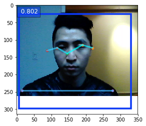
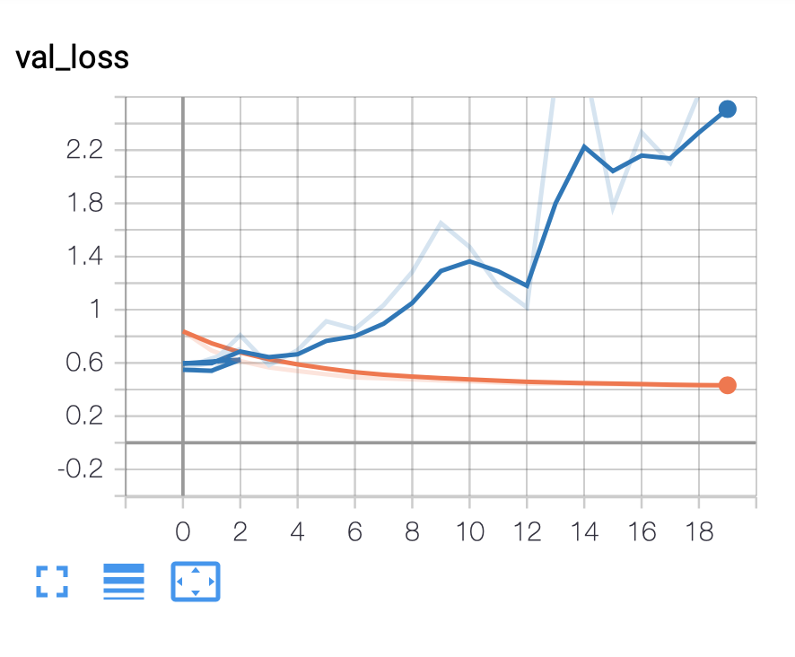

# posture_Model

## Installation
Run the command `pip3 install -r requirements.txt` to install all the python package dependencies.

## Reproducibility
Execute the notebook `PoseNet.ipynb` and follow the instructions.

(Optional)
3. In the root directory, place a video file of filetype and with the file extension `mp4` for extracting your own data, and launch the extraction in `PoseNet.ipynb`.

## Model explanation
The model predicts different human postures based on camera images. 

## Our approach

We took different videos of us, and extract the corresponding sequence of pictures, and we do the labelisation by hand using a python script.

Our first approach was to use the full images to classify the different postures. But the model takes time to train, and a lot of overfitting was present, even with pre trained model, data augmentation and regularizations techniques. The only solution was to add more images, but we did not have the time for that.

We decided to take a completely new approach. Instead of training the model based on RGB images, we decided to train the model based on the output of an existing human pose estimation model: Google's PoseNet. [Blog post][https://medium.com/tensorflow/real-time-human-pose-estimation-in-the-browser-with-tensorflow-js-7dd0bc881cd5]

The idea is that, using 17 2D points instead of a full image, it will be much more difficult for the network to overfit.

This approach can be seen as transfer learning for new classes of human pose estimations.
To our knowledge, we did not see similar techniques in the litterature.

This is the part of our machine learning pipeline that is trainable. Only a linear model on 34 parameters:

### Results

We compared both results by looking at the validation loss.
As the graphics below demonstrate, the convergence of the new model is much faster, and the `val_loss` is slower. 

The blue line corresponds to our model based on pose estimations, whereas the other model is based on a pretrained MobileNet.

### PoseNet explanation
PoseNet is an existing network, who tries to predict the 17 basics keypoints of human pose :

And here is the neural network architecture to predict the 17 keypoints (a mobile net with a heatmap for each keypoint as output):

